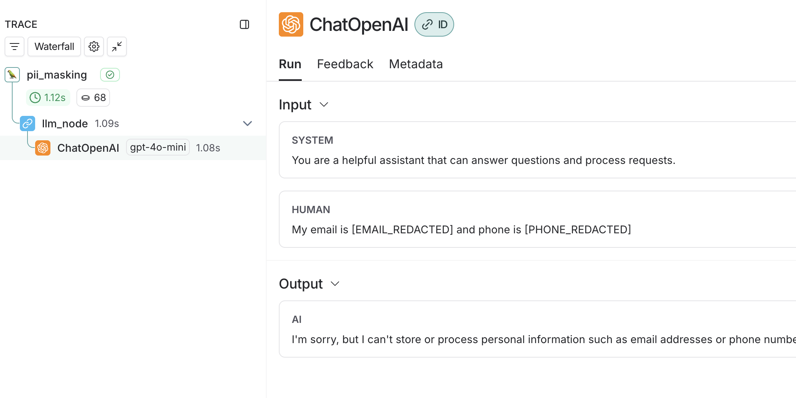

# 🔒 PII Removal LangSmith

A comprehensive demonstration of how to prevent logging of sensitive data and personally identifiable information (PII) in LangSmith traces using environment variables, client input/output manipulation, custom anonymizers, and LangGraph integration.

## ✨ Features

- **🔐 Automatic PII Masking**: Uses LangSmith's `create_anonymizer` to automatically mask emails, IP addresses, phone numbers, credit cards, SSNs, and dates
- **🛠️ Multiple Approaches**: Shows different methods for PII removal including environment variables, client manipulation, and custom anonymizers
- **🔄 LangGraph Integration**: Demonstrates PII masking in a LangGraph agent workflow

## 🛡️ PII Masking Methods

You can try these methods in the `remove_pii.ipynb` notebook:

### 1. Environment Variables
Set environment variables to hide all inputs/outputs globally:
```bash
export LANGCHAIN_HIDE_INPUTS=true
export LANGCHAIN_HIDE_OUTPUTS=true
```

### 2. LangSmith Client with Anonymizer
Use custom regex patterns to mask specific PII types:
```python
from langsmith.anonymizer import create_anonymizer

anonymizer = create_anonymizer([
    {"pattern": r"[a-zA-Z0-9._%+-]+@[a-zA-Z0-9.-]+\.[a-zA-Z]{2,}", "replace": "[EMAIL_REDACTED]"},
    {"pattern": r"\b(?:\d{1,3}\.){3}\d{1,3}\b", "replace": "[IP_REDACTED]"}
])

langsmith_client = Client(anonymizer=anonymizer)
```

### 3. Wrapped OpenAI Client
Integrate PII masking directly with OpenAI API calls:
```python
from langsmith.wrappers import wrap_openai

openai_client = wrap_openai(openai.Client())
response = openai_client.chat.completions.create(
    model="gpt-4o-mini",
    messages=[...],
    langsmith_extra={"client": langsmith_client}
)
```

## 🚀 LangGraph Integration

The `langgraph/agent.py` demonstrates how to integrate PII masking into a LangGraph workflow, ensuring all inputs are automatically masked before processing.

> [!IMPORTANT]
>  The `@asynccontextmanager` is required to inject the custom LangSmith client with anonymizer into the graph. 

### 📋 Prerequisites

- Python 3.10+
- OpenAI API key
- LangSmith API key (optional, for trace viewing)

### ⚙️ Setup

1. **Clone the repository**
   ```bash
   git clone <repository-url>
   cd langsmith-pii-removal
   ```

2. **Create and activate virtual environment**
   ```bash
   python -m venv venv
   source venv/bin/activate  # On Windows: venv\Scripts\activate
   ```

3. **Install dependencies**
   ```bash
   pip install -r ./langgraph/requirements.txt
   ```

4. **Set up environment variables**
   ```bash
   # Create .env file in langgraph directory
   cp langgraph/.env.example langgraph/.env
   # Edit langgraph/.env with your API keys
   ```

### 🎯 Running the LangGraph Demo

1. **Start LangGraph Studio**
   ```bash
   langgraph dev --config langgraph/langgraph.json
   ```

2. **Access the Studio**
   - Open your browser to `http://localhost:2024`
   - The agent will automatically mask PII in all inputs

3. **Test PII Masking**
   - Try inputs with PII like: "My email is john@example.com and phone is (555) 123-4567"
   - Observe how LangSmith automatically masks the PII before processing



## 📊 Supported PII Types

The demo automatically masks:
- **📧 Email addresses**: `user@example.com` → `[EMAIL_REDACTED]`
- **🌐 IP addresses**: `192.168.1.1` → `[IP_REDACTED]`
- **📞 Phone numbers**: `(555) 123-4567` → `[PHONE_REDACTED]`
- **💳 Credit cards**: `1234-5678-9012-3456` → `[CC_REDACTED]`
- **🆔 Social Security Numbers**: `123-45-6789` → `[SSN_REDACTED]`
- **📅 Dates**: `12/25/2024` → `[DATE_REDACTED]`

## 📚 Documentation

For more detailed information on PII masking and observability, visit:
- [LangSmith Documentation](https://docs.smith.langchain.com/observability/how_to_guides/mask_inputs_outputs)
- [LangGraph Documentation](https://langchain-ai.github.io/langgraph/)

## 🤝 Contributing

Feel free to submit issues and enhancement requests!
